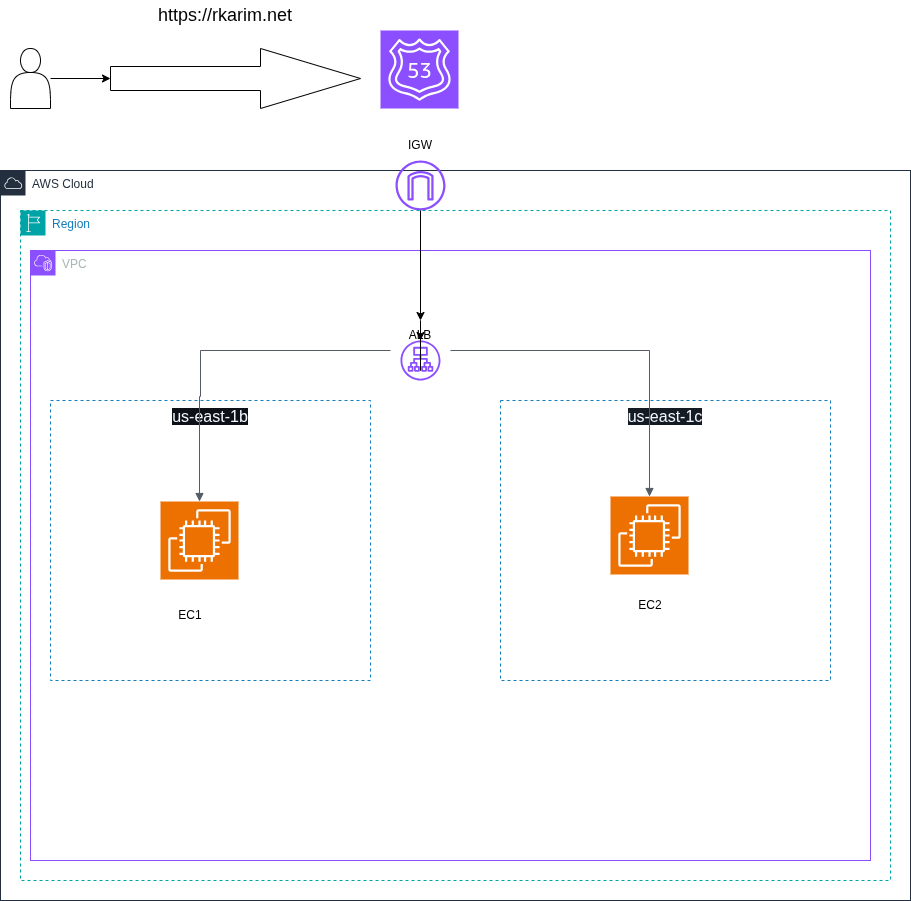
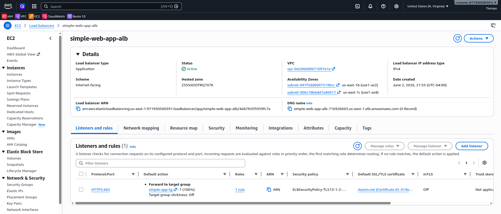
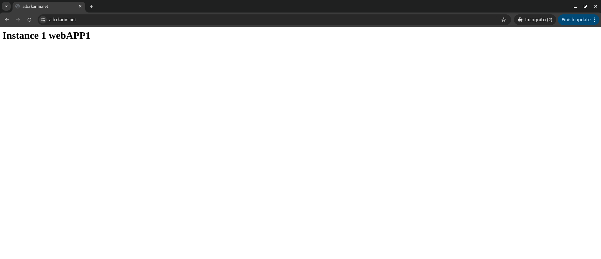
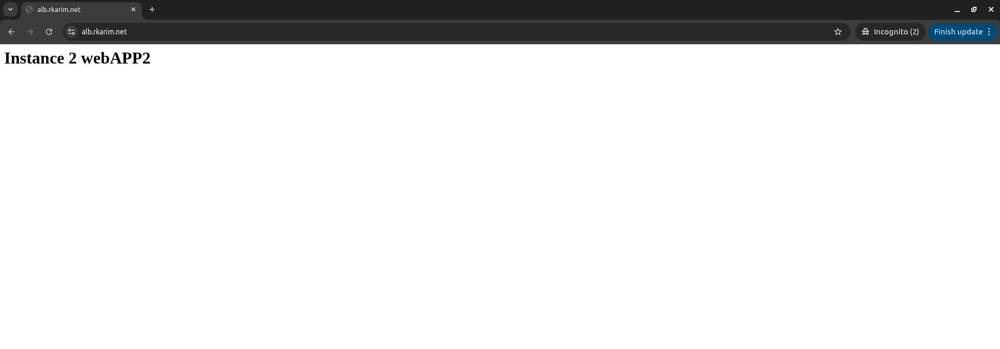
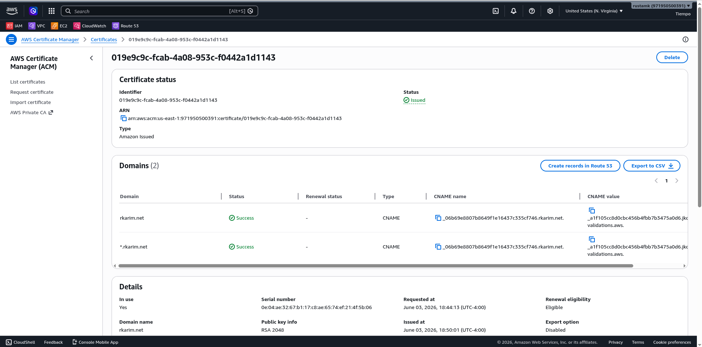
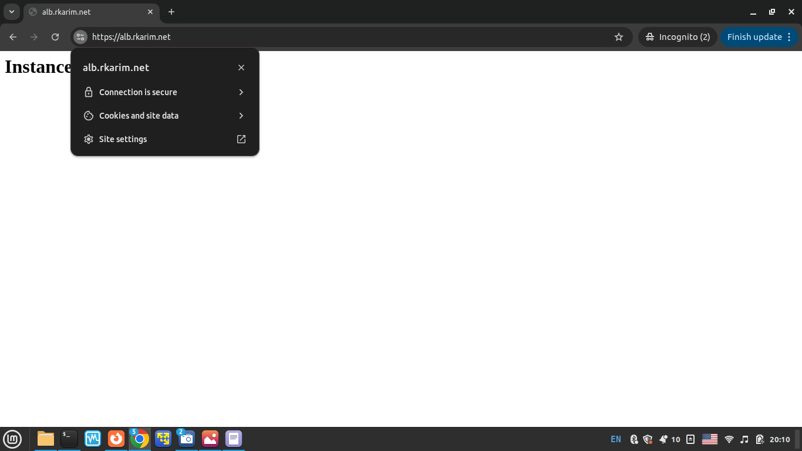

# AWS Application Load Balancer Project

## Overview
Deployed two EC2 instances behind an Application Load Balancer (ALB) across multiple Availability Zones. Configured HTTPS using AWS Certificate Manager (ACM) and Route53 DNS with an Alias record pointing to the ALB.

---

## Architecture Diagram



---

## What I Built

| Component | Details |
|---|---|
| VPC | demo-vpc |
| Public Subnet 1 | 10.0.0.0/24 (us-east-1b) |
| Public Subnet 2 | 10.0.3.0/24 (us-east-1c) |
| ALB | Spans both public subnets (us-east-1b, us-east-1c) |
| EC2 Instance 1 | Public Subnet 1 (us-east-1b) |
| EC2 Instance 2 | Public Subnet 2 (us-east-1c) |
| ALB | Internet-facing, spans 2 AZs |
| Target Group | Both EC2 instances, HTTP port 80 |
| ACM Certificate | rkarim.net + *.rkarim.net (wildcard) |
| Route53 | alb.rkarim.net → Alias → ALB |
| HTTPS | Port 443 with ACM certificate |

---

---

## Traffic Flow

```
User
  ↓ HTTPS port 443
Route53 (alb.rkarim.net → Alias → ALB)
  ↓
ALB (public subnets — us-east-1b, us-east-1c)
  ↓ HTTP port 80
Target Group
  ↓
EC2 Instance 1 (public-subnet us-east-1b)  or  EC2 Instance 2 (public_subnet2 us-east-1c)
```

---

## Security Design

**ALB Security Group:**
```
Inbound:
HTTPS  port 443  → 0.0.0.0/0  (anyone from internet)
HTTP   port 80   → 0.0.0.0/0  (anyone from internet)
```

**EC2 Security Group:**
```
Inbound:
HTTP  port 80  → ALB Security Group only
```

Key decision — EC2 SG references ALB SG as source, not an IP or 0.0.0.0/0.
This means:
- EC2 instances are completely unreachable from internet directly
- Only traffic coming through ALB reaches EC2
- Even if someone finds the EC2 private IP — blocked

---

## HTTPS Setup

**ACM Certificate:**
- Requested certificate for `rkarim.net` and `*.rkarim.net` (wildcard)
- Wildcard covers all current and future subdomains automatically
- DNS validation via CNAME record in Route53
- Auto-renews every 13 months — no manual intervention needed

**Why wildcard certificate:**
```
*.rkarim.net covers:
alb.rkarim.net      ✅
vpc.rkarim.net      ✅
api.rkarim.net      ✅
any.rkarim.net      ✅
One certificate — all future projects covered
```

**ALB HTTPS Listener:**
- Port 443 with ACM certificate attached
- ALB handles all encryption/decryption
- EC2 instances receive plain HTTP — no certificate management needed on instances

---

## Route53 Configuration

**Records in hosted zone rkarim.net:**
```
NS     → 4 Route53 nameservers (auto created)
SOA    → admin info (auto created)
CNAME  → ACM validation record (auto created by ACM)
A      → alb.rkarim.net → Alias → dev-assignment-alb
```

**Why Alias instead of CNAME:**
- ALB has no fixed IP — Alias resolves dynamically
- Alias is free — no DNS query charges
- Supports Route53 health checks
- Works on root domain — CNAME does not

---

## Load Balancing Test

Refreshing `https://alb.rkarim.net` alternates between:
```
Instance 1  ←→  Instance 2
```

Proves ALB is distributing traffic across both EC2 instances in different AZs.

---

## Screenshots

### ALB Active


### Target Group — Both Instances Healthy



### ACM Certificate Issued


### HTTPS Working


---

## Key Learnings

- ALB requires minimum 2 subnets in different AZs — built for high availability by default
- EC2 SG should reference ALB SG as source — not IP address, not 0.0.0.0/0
- ACM uses CNAME for validation so certificate auto-renews without manual intervention
- Alias record is always preferred over CNAME for AWS resources — free, faster, health check support
- Wildcard certificate covers all subdomains — request once, use forever
- ALB handles HTTPS — EC2 instances only need to serve plain HTTP

## Note on Architecture

EC2 instances in this assignment are placed in public subnets due to no NAT Gateway being configured. Without NAT Gateway, private subnet EC2s cannot reach the internet to download packages via user data.

In a production environment the correct architecture would be:
```
EC2 instances → private subnet (no public IP)
NAT Gateway   → public subnet (outbound internet for EC2s)
ALB           → public subnet (only public facing component)
```

This ensures EC2 instances are truly unreachable from the internet — not just protected by Security Group rules. Direct access is still blocked in this setup via EC2 SG which only allows traffic from ALB SG.

---

## Key Decisions

| Decision | Reason |
|---|---|
| EC2 in public subnet with no direct access | EC2 SG blocks all traffic except from ALB SG |
| EC2 SG source = ALB SG | More secure than IP — survives instance restarts, can't be bypassed |
| Wildcard ACM certificate | Covers all future subdomains — no new certificate needed per project |
| Alias over CNAME | Free, faster, supports health checks, works on root domain |
| 2 AZs for ALB and EC2 | High availability — if one AZ fails, other keeps serving traffic |

---

## Cleanup Order

```
1. Delete ALB
2. Delete Target Group
3. Terminate EC2 instances
4. Release ACM certificate
5. Delete Route53 records
6. Delete hosted zone
7. Delete subnets
8. Delete VPC resources
```

---

## Cost

| Resource | Cost |
|---|---|
| ALB (~2 hours) | ~$0.05 |
| EC2 x2 (~2 hours) | ~$0.05 |
| ACM Certificate | Free |
| Route53 Hosted Zone | $0.50/month |
| **Total** | **~$0.60** |
