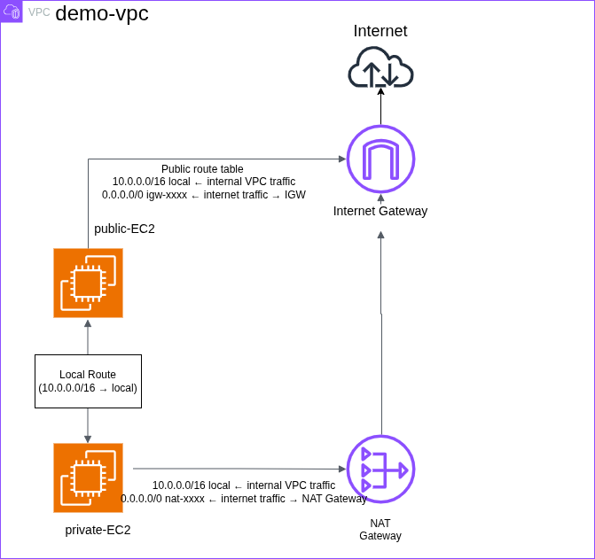

# AWS VPC Networking Project

## Overview
Built a custom AWS VPC from scratch with public and private subnets, demonstrating core cloud networking concepts including routing, security, and monitoring.

---

## Architecture Diagram



---

## What I Built

| Component | Details |
|---|---|
| VPC | 10.0.0.0/16 |
| Public Subnet | 10.0.1.0/24 |
| Private Subnet | 10.0.2.0/24 |
| Internet Gateway | Public internet access |
| NAT Gateway | Private subnet outbound access |
| Elastic IP | Fixed outbound IP for NAT Gateway |
| Public EC2 | Bastion Host — SSH jump point |
| Private EC2 | No public IP — internal only |
| Security Groups | Least privilege access rules |
| Route Tables | Separate routing for public and private |
| CloudWatch | EC2 instance monitoring |

---

## Traffic Flow

**Inbound — User to App:**
```
User → Internet → IGW → NACL → Public EC2
```

**Internal — Bastion to Private EC2:**
```
Public EC2 → Private SG → Private EC2
(via local route — 10.0.0.0/16)
```

**Outbound — Private EC2 to Internet:**
```
Private EC2 → NAT Gateway → IGW → Internet
```

---

## Security Design

**Public EC2 Security Group:**
```
Inbound:
SSH  port 22  → My IP only
ICMP          → My IP only
```

**Private EC2 Security Group:**
```
Inbound:
SSH  port 22  → Public EC2 Security Group only
ICMP          → Public EC2 Security Group only
```

Key decision — Private SG references Public SG as source, not an IP address. This means even if the Public EC2 IP changes, the rule stays valid.

---

## Route Tables

**Public Route Table:**
```
10.0.0.0/16  →  local       (internal VPC traffic)
0.0.0.0/0    →  IGW         (internet traffic)
```

**Private Route Table:**
```
10.0.0.0/16  →  local       (internal VPC traffic)
0.0.0.0/0    →  NAT Gateway (outbound only)
```

Both EC2s communicate internally via the **local route** — traffic never leaves the VPC.

---

## Screenshots

### VPC


### Subnets


### Internet Gateway


### NAT Gateway


### Route Tables


### Security Groups


### EC2 Instances


### SSH into Public EC2


### SSH into Private EC2 via Bastion


### CloudWatch Monitoring


---

## Key Learnings

- Public vs private subnet is determined by route table — not IP type
- Every resource always gets a private IP regardless of subnet
- NAT Gateway must live in public subnet — it needs IGW access
- Security Groups are stateful — inbound rule automatically allows response
- NACLs are stateless — must allow both inbound and outbound explicitly
- NAT Gateway must be deleted before releasing Elastic IP
- Mobile carriers use CGNAT — /32 IP whitelisting may not work, use /16 range

---

## Cleanup Order

Resources deleted after completion to avoid unnecessary charges:

```
1. Terminate EC2 instances
2. Delete NAT Gateway (wait until fully deleted)
3. Release Elastic IP
4. Detach and delete Internet Gateway
5. Delete subnets
6. Delete route tables
7. Delete VPC
```

---

## Cost

Total cost for this project (completed in one session):

| Resource | Cost |
|---|---|
| NAT Gateway (~2 hours) | ~$0.10 |
| EC2 x2 (~2 hours) | ~$0.05 |
| Elastic IP | ~$0.01 |
| **Total** | **~$0.16** |
